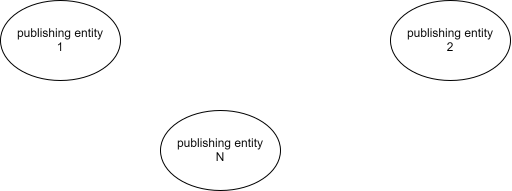

[back to main](./main.md)

# Developer documentation

To start developing, follow the [about and install guide](./about-and-install.md). The architecture of `dscme` is depicted, as best as i could, [here](./architecture.md). If you are wondering why we do what we do, read the [motivation](#motivation).

Other dev docs:

-   [folder structure](./dev-docs-folder-structure.md)
-   working with [aggregator](./dev-docs-working-with-aggregator.md)
-   working with [core-v2 types](./dev-docs-working-with-core2-types.md)

## Motivation

### Why to use Dataspecer

Imagine you have to ensure that a group of entities publish some information about themselves. Let us take villages/towns/cities that need to publish information about tourist destinations. The goal is to know the single-point-of-contact, opening hours, barrier-free access and whether there is a lower price for elderly.

The problem is that IT specialists in every village are not synchronized with each other and the data published are not interoperable.

The solution is to have a data specification that ensures said interoperability.

Now that data interoperability is ensured, another problem (much less severe) becomes the process of creating such data specification. Luckily, there is already the tool named [Dataspecer](https://dataspecer.com) that manages data specifications.

It maps concepts from [ontologies](<https://en.wikipedia.org/wiki/Ontology_(information_science)>) to data structures. Data structures can then be used as a basis for generating validation JSON schemas, CSV, or Shacl and ShEx validation for RDF.

The problem with Dataspecer is that it only maps concepts that are contained in the source ontology. If there is a concept you need to use and it doesn't exist there, Dataspecer won't help.

That is the reason why we created `dscme` - Dataspecer Conceptual Model Editor.

### Conceptual modeling and Application profiles

Conceptual modeling aims on creating abstract representations of systems to simplify communication between people involved and builds certain standards on knowledge exchange. It identifies entities, relationships, and constraints within a domain.
Application profiles are customized specifications that define how a set of concepts should be used for a particular application or domain. If you want to learn more, see the [Semic style guide](https://semiceu.github.io/style-guide/1.0.0/terminological-clarifications.html#sec:what-is-an-ap-specification). By the way, the whole [Terms clarification section](https://semiceu.github.io/style-guide/1.0.0/terminological-clarifications.html) is a useful source of information for the context of `dscme`.

### Similar tools

There are multiple conceptual modeling tools that let you model in ERD (entity-relationship diagrams), UML, flowcharts etc. `dscme` is a browser-based, open-source conceptual model editor. It is, by the looks of it, similar to other tools like Protégé Web, WebVOWL, and maybe others. It provides an environment for ontology and data modeling. Like these tools, it supports multiple models and offers various views on concepts, allowing for easier interaction.

However, `dscme` differs by supporting IRIs for all resources, enabling precise identification and linking of web-based data. Additionally, by setting for example base IRIs for models and supporting application profiles, `dscme` offers more tailored and versatile metadata management capabilities compared to the more general features of other conceptual modeling tools.

## Decisions and future improvements

We have listed future improvements [here](./future-improvements.md). Those are improvements a user could use. For developer improvements:

-   There could be some more work done on the `EntityProxy` so that it supports changes of fields as well and propagates them to the model/aggregator.
-   Model colors are now in visual models / views. It would be best to have them more centralized, possibly to have them in the package configuration. Individual views could also change colors of models though.
-   The color palette offer could be improved either by dynamic color generation based on that contrasts best with colors already selected. Or you could configure better contrasting colors as well. They are in tailwind format so tools like [coolors](https://coolors.co/) could do the trick.
-   State management is now done with contexts. I don't think it insufficient but some third party library might make it feel, from the DX point of view, a little nicer.
-   [Edge renderings](./future-improvements.md#edge-renderings)
-   Logging. I just used the plain old `console.log`. If there was something like Serilog is for .NET, it would be very pleasant. Some configuration settings could help with hiding unnecessary logs for the users
