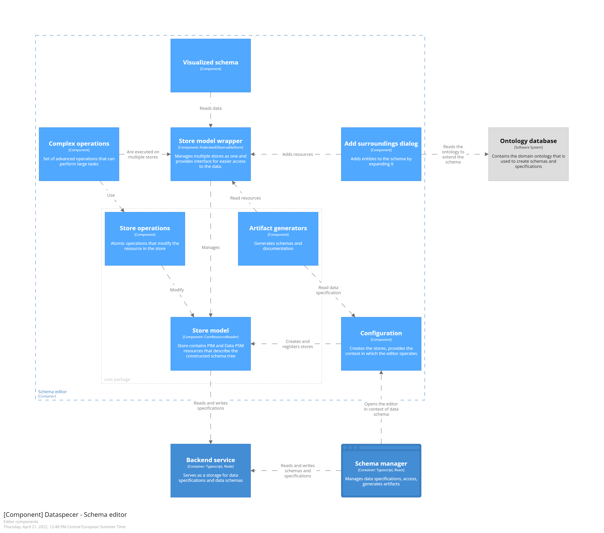

# editor's components structure

The editor is a single site web application that communicates with the [backend](../../../services/backend) service to load and store data schemas. The editor must be opened with URL parameters specifying its context. Otherwise, the dummy specification is created only for testing and development purposes.

**[Configuration](../src/configuration)**, based on the context the app is opened, creates stores, usually `HttpSynchronizedStore`, which is `CoreModelReader & CoreModerWriter`. Because the model is typically stored across multiple stores, `FederatedObservableStore` from [`@dataspecer/federated-observable-store`](../../../packages/federated-observable-store) package manages all core stores uniformly.

To easily work with the store in React, [`@dataspecer/federated-observable-store-react`](../../../packages/federated-observable-store-react) package is used, which automatically re-renders HTML if the resource changes.

The editor has a set of pre-defined **[complex operations](../src/operations)** that are executed on `FederatedObservableStore`, which propagates changes into the individual core stores, and after every operation, stores are synced with the backend. The synchronization is registered in the configuration part of the application.

Then, there are several dialogs in the application. Namely, [detail](../src/components/detail) dialogs show detail about the given resource and may edit its properties. **[Add surroundings](../src/components/add-interpreted-surroundings)** dialog prompts the user to select the surrounding of the selected class, to be added to the schema. It uses `CimAdapter`, which is set again in the configuration part of the application. Currently, there is only one adapter, but we are planning to add others. Then, the user could decide in the manager which ontology he or she would like to use, and this will be in the context the editor is opened.

