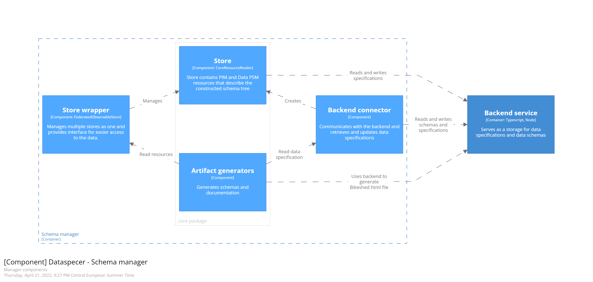

# manager application components structure

The schema manager is a single-page application that communicates with the **[backend](../../../services/backend) service** to load and store data specifications and create schemas. It also opens the [editor](../../editor) application in the context of data specification and schema that is being edited.

Similar to the editor, the main components are [**Store**](../../../packages/core/src/core/core-reader.ts), which represents s storage of PIM and Data PSM resources, and [**Store Wrapper**](../../../packages/federated-observable-store), which merges the stores into one.

**Artifact generators** generate schemas, documentation, images, and transformations that are zipped and available to download by users.

To communicate with the [**Backend service**](../../../services/backend), a [**Backend connector**](../../../packages/backend-utils/src/connectors/backend-connector.ts) is used.

---

The manager uses React router to create multiple pages. The components for pages are in the `routes` directory. `artifact` directory contains functionality to generate artifacts, helper files, and zip compressor.

