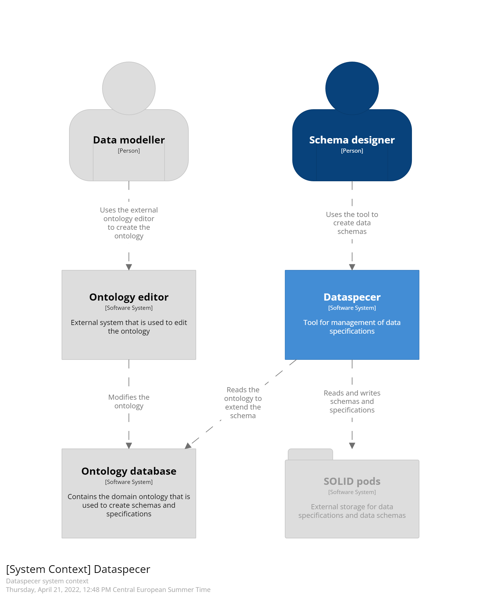
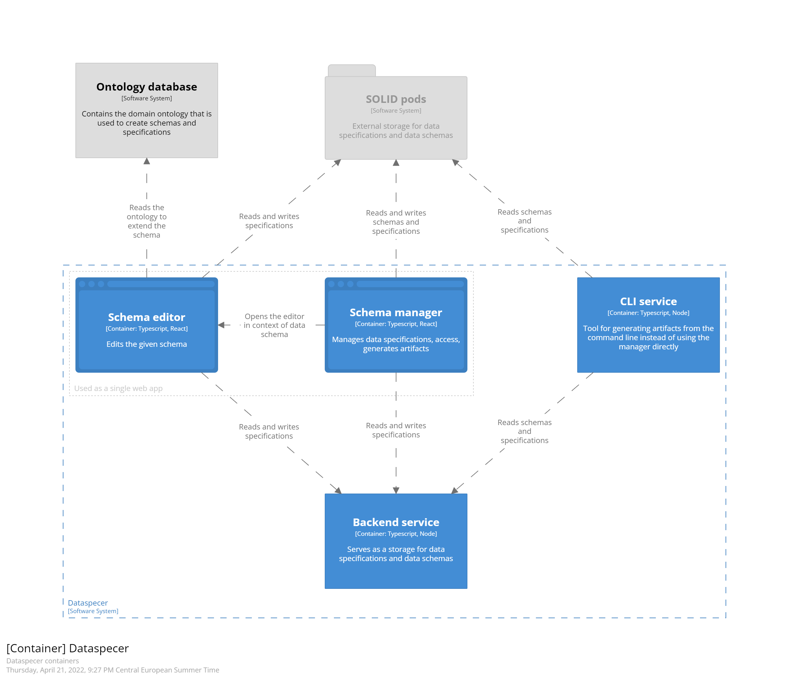

# Project structure

The whole project is managed as a monorepository. The codebase is split into smaller, more self-contained packages, applications, and services linked to each other by Lerna. See [Lerna and packages](2022-02-06-lerna-and-packages.md) for more details. This simplifies the development as the changes between different packages are synced automatically, and changes across multiple packages are transparent.

## File structure

Packages are split into several directories to keep things organized. You can see the full list in the main [README.md file](../README.md). Each package has a README.md file that contains more information.
- [applications](../applications)
- [packages](../packages)
- [services](../services)

Besides these directories, the [documentation](../documentation) contains general documentation and design decisions, and [utils](../utils) is intended for various helper scripts and utilities.

## Software architecture

Dataspecer requires access to an ontology database. The ontology is then used to help schema designers to design the schemas easily by suggesting appropriate resources. We plan to add support for non-interpreted classes, which allow users to create their own ontology directly in the Dataspecer. Currently, only the SGOV ontology is supported.

The tool contains its own database (as it will be clear from the container view), but we plan to support SOLID Pods in the future. SOLID is already denoted in the diagram in grey color to stress that this feature is not supported yet.

## Dataspecer's containers

Dataspecer UI consists of two webapps - [editor](../applications/editor) and [manager](../applications/manager). We deploy them together; the manager into the root and the editor into the `editor/` directory. The manager is the main application where users can create data specifications, generate artifacts and create schemas. From the manager, users are redirected to the editor, where they can modify the schemas.

Both manager and editor use [backend service](../services/backend) to store and read data specifications and schemas. When we implement the support for SOLID, the backend for storing data may not be used.

The backend also serves for generating [Bikeshed](https://tabatkins.github.io/bikeshed/) documentation from the source, because there is no public API.

Finally, there is a [CLI](../applications/cli) for generating artifacts from given data specifications. CLI also uses the backend to retrieve the data to generate the files.

