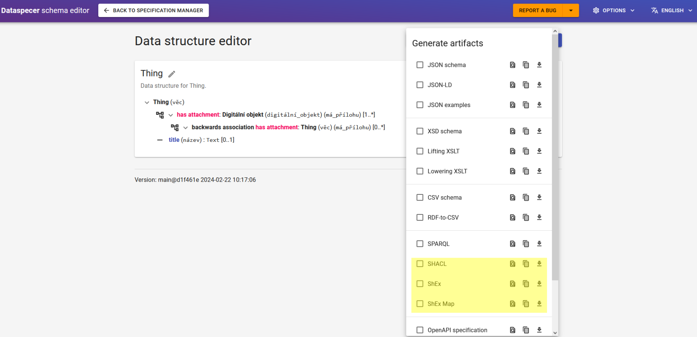

# SHACL and ShEx artifacts

This documentation was created for both SHACL and ShEx artifacts in one place. If you are interested in only one of the artifact generators, kindly skip the parts that concern the other generator.

## How to generate artifacts and use the generated artifacts

The user can generate SHACL and ShEx validating schemas using the Dataspecer tool available on the website: [Dataspecer](https://tool.dataspecer.com/).

After creating some data specification (or opening any of the already existing ones), there is a drop menu upon clicking the button "Artifacts".


From the multiple selection menu, choose either SHACL if you want to validate your data with SHACL validator, or ShEx and ShEx QueryMap, if you want to validate the data in a ShEx validator.



You can either just tick the box and copy the generated artifact to your chosen validator or you can copy the artifact to the clipboard right away by clicking the "Copy to Clipboard" option right to the artifact name, or download a file with the text of the generated artifact next to the "Copy to Clipboard" icon.


After ticking one of the choice boxes from the artifacts menu, an artifact is generated on the screen in the background. 


### Validating data with SHACL artifact

After generating the artifact, you can either use your own preferred SHACL validator or if you do not have any, you can try validating the data with SHACL with this online validator: [SHACL Playground](https://shacl.org/playground/)

To validate data with the SHACL validator, you need 2 inputs: 
- the SHACL validating schema
- the data in RDF format (data graph)

The validating schema describes, how the data structure should look like in your data. It also implicitly contains directives, which data nodes validate.

How to obtain the SHACL validating schema was already explained in the common section for both generators "How to generate artifacts and use the generated artifacts".

If you have your RDF data that you want to validate whether they conform to the data specification, use them. If you do not have any sample data, go once more to the "Artifacts" button in the top right corner of the Dataspecer tool and generate one more artifact called "JSON examples". You can use this generated sample data to try out validating this data against the generated SHACL validating schema.

Now that you have both inputs for validating in SHACL, open the online SHACL validator ([SHACL Playground](https://shacl.org/playground/)).

 - The left input window named "Shapes Graph" is where you input the generated SHACL artifact. 
 - Click on the "Update" button down below the "Shapes Graph" input window. Make sure that the Format next to the Update button is set to "Turtle".
 - The right input window named "Data Graph" is where you input the generated JSON examples artifact or your data that will be validated. 
 - Click on the "Update" button down below the "Data Graph" input window. Make sure that the Format next to the Update button is set to "JSON-LD" if you are using the generated JSON examples sample data. If you are using your data, make sure that the data format matches with the Format setting (currently only Turtle and JSON-LD are possible). 
 - Now you should see the complete Validation Report in the bottom right window on the screen. If the data conforms, the Validation report is very brief, informing you about the conformity. If the data do not conform, the validation report points out the data issue that was found by the SHACL validator.

After going through the "Validation Report", the data validation process with the SHACL validator and the generated SHACL artifact from Dataspecer is complete.


### Validating data with ShEx and ShEx QueryMap artifacts

After generating the artifact, you can either use your own preferred ShEx validator or if you do not have any, you can try validating the data with ShEx with this online validator: ([ShEx2 - Simple Online Validator](http://shex.io/webapps/shex.js/doc/shex-simple.html))

To validate data with the ShEx validator, you need 3 inputs: 
- the ShEx validating schema
- the data in RDF format (data graph)
- the ShEx Query Map 

The validating schema describes, how the data structure should look like in your data. The query map states, which data nodes are going to be tested from the supplied data graph.

How to obtain the "ShEx" validating schema and "ShEx QueryMap" artifacts was already explained in the common section for both generators "How to generate artifacts and use the generated artifacts".

If you have your RDF data that you want to validate whether they conform to the data specification, use them. If you do not have any sample data, go once more to the "Artifacts" button in the top right corner of the Dataspecer tool and generate one more artifact called "JSON examples". You can use this generated sample data to try out validating this data against the generated ShEx validating schema and generated ShEx Query Map.

Now that you have all inputs for validating in ShEx, open the online ShEx validator ([ShEx2 - Simple Online Validator](http://shex.io/webapps/shex.js/doc/shex-simple.html)).

 - The left blue input window is where you input the generated validating ShEx artifact. 
 - The right green input window is where you input the generated JSON examples artifact or your data that will be validated. 
 - The small input window with a white background is where you input the ShEx QueryMap. Make sure you are inputting the QueryMap to the tab that is called "Query Map" as there are also different ShEx Maps, that can be used to choose the data to validate.
 - Click the "validate (ctrl-enter)" button. 
 - Now you should see the complete Validation Report at the bottom of the screen. If the data conforms, the Validation report is very brief, informing you about the conformity. If the data do not conform, the validation report points out the data issue that was found out by the ShEx validator.

After going through the validation report, the data validation process with the ShEx validator and the generated ShEx artifact from Dataspecer is complete.

## Data nodes targeting with SHACL and ShEx

To validate data, SHACL and ShEx need to set a node, which is going to be validated against a specific structure in data. 

From this targetted node, SHACL specifies a structure to which the data needs to conform. The target does not need to be the root of the data nor the data structure as SHACL allows pointing to properties that are coming into the targetted node, as opposed to usually describing structure downwards the structure tree. 

ShEx targets data nodes with the help of ShEx Maps. Here in Dataspecer, ShEx Query Maps are used as they are more general than fixed maps that rely on data node IRIs.

## Main cases for SHACL and ShEx targeting

This part describes the main cases of targetting where the common tools of SHACL language and ShEx Query Maps can be used directly.

### 1) The root of the structure ALWAYS has a unique type
If the rdf:type of the structure is unique, it can be targetted by `sh:targetClass` in SHACL or `FOCUS rdf:type <typeIRI>` in ShEx Query Map. 

This can only be used when Explicit instance typing is set to ALWAYS because if the type determination is missing in the data, the data won't be checked against the created shape.
Each value of sh:targetClass or rdf:type is an [IRI](https://www.w3.org/TR/shacl/#dfn-iri).

Examples from generated artifacts:
SHACL generated NodeShape (without the rest of the whole artifact)
```
<d7528e03c25e75bf0abc589ed5545ad5turistický_cílShape> a sh:NodeShape;
    sh:targetClass <https://slovník.gov.cz/datový/turistické-cíle/pojem/turistický-cíl>;
    sh:nodeKind sh:IRI;
    sh:description "Samostatný turistický cíl."@cs, "A separate tourist destination"@en;
    sh:name "Tourist destination"@en, "Turistický cíl"@cs.
```
ShEx generated Query Map
```
{ FOCUS rdf:type <https://slovník.gov.cz/datový/turistické-cíle/pojem/turistický-cíl>}@<https://myexample.com/d7528e03c25e75bf0abc589ed5545ad5turistický_cílShExShape>
```

### 2) The root of the structure contains a UNIQUE predicate leading from it
If the root has a *unique* predicate in attributes with cardinality [1..x], it can be used for target by `sh:targetSubjectsOf` in SHACL and `FOCUS <attributeIRI> _` in ShEx.
If the predicate is [0..x], there is a chance the predicate is not available in the data, not allowing the shape to find a focus node.
The [values](https://www.w3.org/TR/shacl/#dfn-value) of sh:targetSubjectsOf in a shape are [IRIs](https://www.w3.org/TR/shacl/#dfn-iri).

Examples from generated artifacts:
SHACL generated NodeShape (without the rest of the whole artifact)
```
<b90280ee7e08a5c68b79c81501934dbdvěcShape> a sh:NodeShape;
    sh:targetSubjectsOf <https://slovník.gov.cz/generický/věci/pojem/relevantní-do>;
    sh:nodeKind sh:IRI;
    sh:name "Thing"@en, "Věc"@cs.
```
ShEx generated Query Map
```
{ FOCUS <https://slovník.gov.cz/generický/věci/pojem/relevantní-do> _}@<https://myexample.com/https://myexample.com/b90280ee7e08a5c68b79c81501934dbdvěcShExShape>
```

### 3) The root has an association, which has ALWAYS UNIQUE type
If the rdf:type of the structure is unique, it can be targetted by `sh:targetClass` in SHACL or with `FOCUS rdf:type <typeIRI>` in ShEx. 
This can only be used when Explicit instance typing is set to ALWAYS for the targetted attribute class because if the type determination is missing in the data, the data won't be checked against the created shape.
The only difference to 1) is, that the structure above the targetted class has to be found using reverse paths (using `sh:path: [ sh:inversePath ex:parent ]` in SHACL). ShEx uses the frame `{FOCUS rdf:type <typeIRI>}@<associationShape>` where the first part of the query map looks similar but the second part references the Shape of the association that has a unique type.
Each value of sh:targetClass in a shape is an [IRI](https://www.w3.org/TR/shacl/#dfn-iri).

Examples from generated artifacts:
SHACL generated NodeShape (without the rest of the whole artifact)
```
<7f2ae0694bd8915c894f2b5fe6d2bebadigitální_objektShape> a sh:NodeShape;
    sh:targetClass <https://slovník.gov.cz/generický/digitální-objekty/pojem/digitální-objekt>;
    sh:class <https://slovník.gov.cz/generický/digitální-objekty/pojem/digitální-objekt>;
    sh:nodeKind sh:IRI;
    sh:description "Digitální objekt je objekt existující pouze v digitálním světě (např. databáze nebo datová sada) příp. se jedná o plně digitalizovaný objekt reálného světa (např. dokument, obrázek nebo kniha)."@cs;
    sh:name "Digitální objekt"@cs.
    sh:property <99900b6869372974338110e9b3ab26e9má_přílohuShape>, [
  sh:path [ sh:inversePath <https://slovník.gov.cz/generický/věci/pojem/věc> ];
  sh:node <b90280ee7e08a5c68b79c81501934dbdvěcShape>
].
```
where <b90280ee7e08a5c68b79c81501934dbdvěcShape> is the root class Shape.

ShEx generated Query Map
```
{ FOCUS rdf:type <https://slovník.gov.cz/generický/digitální-objekty/pojem/digitální-objekt>}@<https://myexample.com/7f2ae0694bd8915c894f2b5fe6d2bebadigitální_objektShExShape>
```
where <https://slovník.gov.cz/generický/digitální-objekty/pojem/digitální-objekt> is the class type of the association from root class and <https://myexample.com/7f2ae0694bd8915c894f2b5fe6d2bebadigitální_objektShExShape> is its ShEx Shape.

### 4) The root has an attribute that contains a UNIQUE predicate leading from it
If the targetted attribute has a *unique* predicate in attributes with cardinality [1..x], it can be used for target by `sh:targetSubjectsOf` in SHACL or `FOCUS <attribute'sAttributeIRI> _` in ShEx.
The only difference to 2) is, that the structure above the targetted node has to be found using reverse paths (using `sh:path: [ sh:inversePath ex:parent ]`). In ShEx the query map references the attribute's shape as the validation shape.
The [values](https://www.w3.org/TR/shacl/#dfn-value) of sh:targetSubjectsOf in a shape are [IRIs](https://www.w3.org/TR/shacl/#dfn-iri).

Examples from generated artifacts:
SHACL generated NodeShape (without the rest of the whole artifact)
```
<7f2ae0694bd8915c894f2b5fe6d2bebadigitální_objektShape> a sh:NodeShape;
    sh:targetSubjectsOf <https://slovník.gov.cz/generický/digitální-objekty/pojem/má-typ-média>;
    sh:class <https://slovník.gov.cz/generický/digitální-objekty/pojem/digitální-objekt>;
    sh:nodeKind sh:IRI;
    sh:description "Digitální objekt je objekt existující pouze v digitálním světě (např. databáze nebo datová sada) příp. se jedná o plně digitalizovaný objekt reálného světa (např. dokument, obrázek nebo kniha)."@cs;
    sh:name "Digitální objekt"@cs.
```
ShEx generated Query Map
```
{ FOCUS <https://slovník.gov.cz/generický/digitální-objekty/pojem/má-typ-média> _}@<https://myexample.com/7f2ae0694bd8915c894f2b5fe6d2bebadigitální_objektShExShape>
```

## Outliers for SHACL and ShEx targeting 
The section below discusses cases where usual SHACL-defined tools don't work. In these cases ShEx Query Map is also not created to ensure creatability in both SHACL and ShEx.

### 1) There are NO unique types
In the first two levels of the structure, there are no unique types of any class. In that case, the rdf:type will be the same for different nodes in different levels of the structure and both will be targetted with `sh:targetClass` or ShEx counterpart. But the aim is to check the structure from only one of them and the other focusNodes will give false Negative results while being checked.
In that case let's check for the second option, checking for unique predicates. 

### 2) There are also NO unique predicates
In the first two levels of the structure, there is no unique predicate with the cardinality [1..x] that would ensure it always occurs in the data.


### 3) There are unique types but the explicit typing of instances is not mandatory
If the unique class has Explicit instances typing is set to OTHER than ALWAYS, there is no guarantee the data will have the rdf:type specified. In that case, there is no certainly focusable node in the data.

### 4) There are unique predicates but are OPTIONAL ... [0..x]
In case there are unique predicates but they are only optional with cardinality [0..x], there is no guarantee they will be present in the to-be-validated data. 

If all outliers 1)-4) are true in the structure, there are no basic SHACL means how to target the focus node from where to validate the data.

# Solution to outliers
- Tell the user to reconsider
  
If all techniques in the first section of this discussion fail, the output on the screen tells the user about this issue in an informative matter and asks them to SET the conditions in whichever manner they feel the most comfortable having their data structure usage in mind. 
Then the user may fix one of the problems at hand by:

- giving one of the first two level classes a unique type
- changing one predicate in the first two levels of the data structure for a unique predicate not in the data structure yet
- setting a unique class type instance typing **ALWAYS**
- setting a unique predicate cardinality to [1..x]


## Targeting failure and how to fix it

In case the artifact cannot be generated, the user sees an error on his screen:


In that case, if the user wants to have the SHACL and ShEx Query Map artifacts generated, there needs to be a structural change to the data specification. Change the data specification so that it fulfills at least ONE of these conditions:
1. The root class has a unique type IRI (Explicit instance typing set to ALWAYS) that is not present anywhere else as class type IRI in the data specification.
2. The root class has a unique attribute that has cardinality [1..x].
3. The association from the root class with cardinality [1..x] and Explicit instance typing set to ALWAYS has a unique class type not present anywhere else in the data specification.
4. The association from the root class with cardinality [1..x] has a unique attribute with cardinality [1..x].