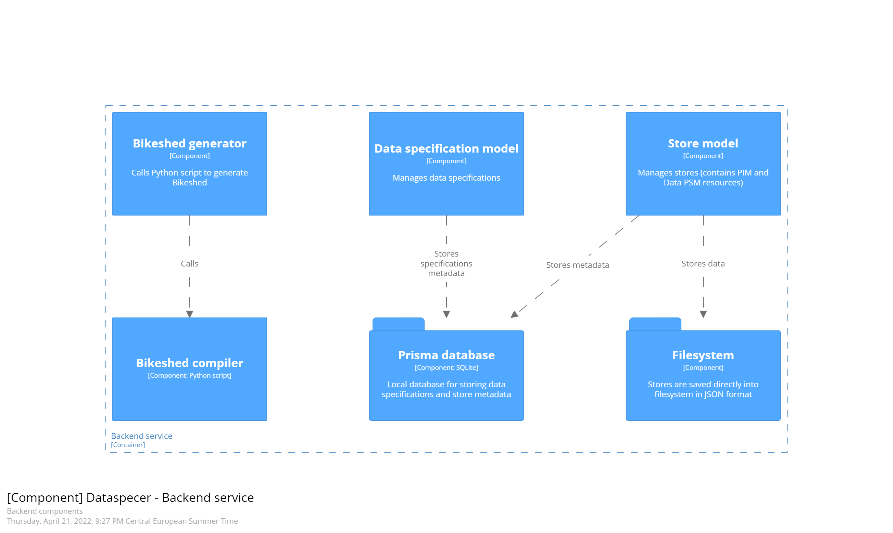

# backend service components structure

The backend service has three separate functions now.

It serves as a [**Bikeshed generator**](../src/transformers/bikeshed.ts) API. Bikeshed has no public API to convert `.bs` files to the final `.html` file. Therefore, it uses the official Python package to compile the Bikeshed source. The Python script is called by JavaScript.

The [**store model**](../src/models/local-store-model.ts) manages stores. Stores are saved directly in the **filesystem** in JSON format. We plan to use the RDF format in the future for everything, stores as well. Store data are stored in [database/stores](../database/stores) directory.

The [**data specification model**](../src/models/data-specification-model.ts) manages data specifications, linked stores, metadata, etc.

As a storage, the [**Prisma database**](https://www.prisma.io/) is used. Prisma is a TypeScript ORM library. The [database schema](../prisma/schema.prisma) is compiled to TypeScript to be used directly in the code. Prisma data are stored in [database/database.db](../database/database.db) file.

